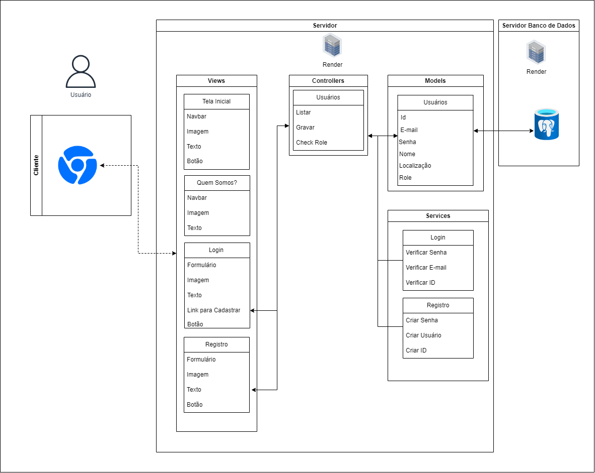
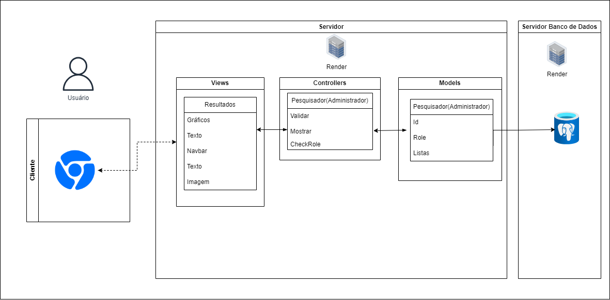
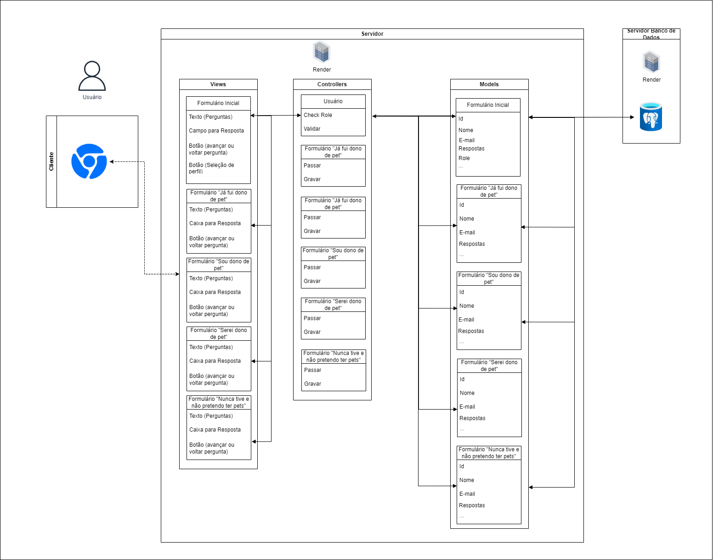

# Ponderada Semana 02 - Fernando Soares de Oliveira

# 1. Imagens das Arquiteturas 

Figura 1 - Arquitetura MVC da tela inicial

Fonte: Material produzido pelo autor (2024)

Figura 2 - Arquitetura MVC da área de administradores

Fonte: Material produzido pelo autor (2024)

Figura 3 - Arquitetura MVC da área de formulários

Fonte: Material produzido pelo autor (2024)

# 2. Informações Gerais
*  **Nome do projeto:** Abandono Zero
*  **Descrição de Projeto:**  &nbsp;O projeto visa desenvolver uma aplicação web em colaboração com o Instituto de Psicologia Animal (Inspa) para coletar dados reais sobre o abandono de animais. A aplicação permitirá que os usuários respondam a pesquisas diretamente, contribuindo para uma compreensão mais profunda do problema e para o desenvolvimento de soluções eficazes. A aplicação deve ser responsiva em dispositivos mobile e desktops, incentivando assim respostas mais abrangentes. 
*  **Arquitetura: &nbsp;MVC**
*  **Ferramenta de digramação:** &nbsp;**Draw.io**, ferramenta de diagramação indicada pelo professor Afonso durante a orientação do projeto.

# 2. O que precisamos proporcionar?
&nbsp;&nbsp;&nbsp;&nbsp; Para garantir uma experiência positiva aos usuários, o site precisa oferecer recursos fundamentais. Primeiramente, é essencial que seja responsivo, adaptando-se perfeitamente a qualquer dispositivo utilizado pelo usuário. Isso assegura que a navegação seja fluida e agradável, independentemente do dispositivo, seja um smartphone, tablet ou desktop. 
&nbsp;&nbsp;&nbsp;&nbsp;Além disso, a privacidade e a segurança são prioridades absolutas. O usuário deve sentir-se confiante de que suas respostas estão protegidas e não serão compartilhadas indevidamente. Implementar medidas rigorosas de segurança garantirá que os dados coletados permaneçam sob controle do Inspa, sem riscos de vazamentos ou violações de privacidade. 
&nbsp;&nbsp;&nbsp;&nbsp;Uma interface intuitiva é fundamental, especialmente considerando a imprecisão do público-alvo do projeto. Facilitar a navegação e o acesso às informações e pesquisas será necessário para incentivar a participação e o engajamento. Elementos como menus claros, botões de fácil identificação e uma estrutura de navegação lógica contribuem para uma experiência intuitiva e satisfatória para todos os usuários.

# 3. O que é MVC?
&nbsp;&nbsp;&nbsp;&nbsp; MVC é a sigla para Model-View-Controller, uma arquitetura feita para programação orientada a objetos, idealizada em 1970. Através dessa arquitetura, uma aplicação pode ser dividida nos três elementos citados anteriormente, com elementos que se relacionam entre si. É de extrema importância que um bom desenvolvimento comece com uma boa arquitetura, pois isso impede futuras confusões. 
&nbsp;&nbsp;&nbsp;&nbsp;Cada palavra no nome dessa arquitetura carrega uma responsabilidade significativa. Esses termos não são apenas rótulos, mas representam os princípios fundamentais que orientam o design e a implementação do sistema. 
 
&nbsp;&nbsp;&nbsp;&nbsp; **Model:** O model em uma arquitetura MVC é responsável pela representação dos dados e pela lógica de negócios do aplicativo. Ele gerencia o acesso aos dados, processa as regras de negócio e interage com o banco de dados, fornecendo os dados necessários para a view e atualizando-os conforme necessário.  
&nbsp;&nbsp;&nbsp;&nbsp; **View:** A view em uma arquitetura MVC é responsável pela apresentação dos dados ao usuário. Ela exibe a interface do usuário e interage com o modelo para obter os dados necessários. A view também responde às ações do usuário, como cliques em botões ou preenchimento de formulários, e envia essas interações para o controlador.  
&nbsp;&nbsp;&nbsp;&nbsp; **Controller:** O controller em uma arquitetura MVC é responsável por receber as entradas do usuário, processá-las e coordenar as interações entre o modelo e a view. Ele interpreta as ações do usuário, atualiza o modelo conforme necessário e seleciona a view apropriada para apresentar os resultados ao usuário. Pode-se dizer que o controller atua como o intermediário entre o modelo e a view, controlando o fluxo de dados e as operações do aplicativo. 

# 4. Arquiteturas

&nbsp;&nbsp;&nbsp;&nbsp;Para explicar melhor como funcionará a solução que eu e meu grupo desenvolveremos, irei explicar algumas das arquiteturas MVC que fiz, explicando cada um de seus elementos. Para uma melhor compreensão, dividi meu site em três partes: tela inicial, área de administradores e área de formulários. 
 
## Arquitetura MVC da tela inicial

Figura 1 - Arquitetura MVC da tela inicial

Fonte: Material produzido pelo autor (2024)

### Models:

&nbsp;&nbsp;&nbsp;&nbsp; O usuário é o grande protagonista dessa página! Não identifiquei a necessidade da elaboração de um outro elemento, portanto, o usuário será responsável por fornecer dados ao banco de dados. Os dados armazenados serão:
* ID: Identificadores, para podermos identificar cada usuário como uma pessoa única. Essa é uma informação que será essencial! Chave primária.
* E-mail: E-mail; Esse dado será coletado para que o Inspa possa ter futuras comunicações com o usuário, promovendo coisas que sejam do interesse do instituto (Isso deverá ser acordado pelo usuário).  
* Senha: Senha definida durante o registro pelo usuário; A senha é fundamental para mantermos o sigilo e a segurança do site. 
* Nome: Nome do usuário; Durante a entrevista com o parceiro, notei que alguns dados são essenciais e sem dúvidas o nome é um deles. Ele nos dá uma visão mais aprodundada sobre quem está respondendo nosso formulário.
* Localização: Localização do usuário; A localização será ideal para mapear foco de determinadas tendências, o que auxiliará e muito durante as pesquisas. 
* Role: Papel de usuário; Fundamental para destinarmos os usuários para a área de formulário e os administradores para a sua própria área. 

### Views: 
&nbsp;&nbsp;&nbsp;&nbsp; Temos ao total 4 views, cada com a sua devida função: 

* Tela inicial: A tela inicial receberá os nossos usuários. Aqui ele terá a sua primeira interação com o site. 
   * Navbar: Barra de navegação do site;
   * Imagem: Imagem sem dredirecionamentos ou qualquer outra função;
   * Texto: Textos informativos, que servirão como guias para o leitor;
   * Botão: Botão que redicionará o usuário ao login.  

* Quem somos?: 
   * Navbar: Barra de navegação do site;
   * Imagem: Imagem sem dredirecionamentos ou qualquer outra função;
   *  Texto: Textos informativos, que servirão como guias para o leitor.

* Login: 
   * Formulário: Armazena as informações fornecidas pelo usuário; 
   * Imagem: Imagem sem dredirecionamentos ou qualquer outra função;
   *  Texto: Textos informativos, que servirão como guias para o leitor; 
   * Link para cadastrar: Caso o usuário não tenha registro, pode clicar aqui e efetuar o seu cadastro; 
   * Botão: Botão redirecionará o usuário com login válido para a área de formulários.

* Registro: 
   * Formulário: Armazena as informações necessárias sobre o usuário; 
   * Imagem: Imagem sem dredirecionamentos ou qualquer outra função;
   *  Texto: Textos informativos, que servirão como guias para o leitor; 
   * Botão: Botão redirecionará o usuário com cadastro válido para a área de formulários.

### Controllers: 
Temos apenas 1 controller, já que apenas 2 das views se comunicarão com o model:

* Usuário: 
   * Gravar: Grava as informações dos usuários;
   * Listar: Lista as informações os novos usuários; 
   * Check Role: Verifica qual o papel do usuário no site e o redireciona para a sua área. 

 

  ### Casos de uso
* **1.** Independente do tipo de usuário, ele é recebido pela view tela inicial.  
* **2.** O usuário deseja conhecer mais sobre o projeto e clica no 'sobre nós', na navbar, e é redirecionado para a view do sobre nós.
* **3.** O usuário volta para a view tela inicial e clica no botão para responder o formulário. 
* **4.** O usuário preenche os campos de formulário de login com dados válidos.
  * **4.1** Caso o usuário não tenha login válido, ele clicará no link para registro e fará seu registro. 
  * **4.2** O usuário preenche os formulários com dados válidos para cadastro. 
   
   

## Arquitetura MVC da área de administradores

Figura 1 - Arquitetura MVC da área de administradores

Fonte: Material produzido pelo autor (2024)

### Models:

&nbsp;&nbsp;&nbsp;&nbsp; O administrador é o único model aqui:
* ID: Identificadores de usuário, essenciais para manter cada administrador com suas devidas informações salvas; 
* Role: A definição de papéis é essencial na área de administradores. Primeiro que essa é uma área somente para administradores, portanto o acesso deve ser averiguado, além disso, não sabemos o quão hierárquico é o processo de pesquisas no Inspa, portanto, cabe a nós oferecermos a eles essa função.   
* Listas: Listas com as respostas de formulários.

### Views: 
&nbsp;&nbsp;&nbsp;&nbsp; Temos apenas 1 view na área de administradores, responsável por mostrar os resultados obtidos com as pesquisas: 

* Resultados: 
   * Gráficos: Gráficos que mostram de forma resumida a porcentagem de algumas informações que podem aparecer juntas;
   * Imagem: Imagem sem dredirecionamentos ou qualquer outra função;
   * Texto: Textos informativos, que servirão como guias para o leitor;
   * Botão: Botão que redicionará o usuário ao login.  
   * Navbar: Barra de navegação do site;

### Controllers: 
Temos apenas 1 controller na área de administradores

* Administrador: 
   * Validar: Valida as informações e alterações que forem feitas pelo administrador;
   * Mostrar: Mostrar as informações que são ocultas para os demais usuários; 
   * Check Role: Verifica qual o papel do usuário no site e o redireciona para a sua área. 

  ### Casos de uso
* **1.** O papel do usuário é validado como login de administrador e ele é redirecionado para a view área de administrador.  
* **2.** A view única é mostrada com elementos como: gráficos, textos, navbar, texto e imagem. 
 
 

## Arquitetura MVC da área de Formulários

Figura 1 - Arquitetura MVC da área de formulários

Fonte: Material produzido pelo autor (2024)

&nbsp;&nbsp;&nbsp;&nbsp; Antes de explicar mais profundamente a arquitetura de nossos formulários, gostaria de ressaltar que esse é um modelo muito repetitivo, portanto, explicarei uma vez cada item, já que todos se repetem.
### Models:

&nbsp;&nbsp;&nbsp;&nbsp; Os formulários possuem a mesma estrutura, com os mesmos propósitos de seus itens. São ao todo 5 Models:
* ID: Identificadores, para podermos identificar cada usuário como uma pessoa única. Essa é uma informação que será essencial! Chave primária.
* E-mail: E-mail; Esse dado será coletado para que o Inspa possa ter futuras comunicações com o usuário, promovendo coisas que sejam do interesse do instituto (Isso deverá ser acordado pelo usuário).  
* Senha: Senha definida durante o registro pelo usuário; A senha é fundamental para mantermos o sigilo e a segurança do site. 
* Nome: Nome do usuário; Durante a entrevista com o parceiro, notei que alguns dados são essenciais e sem dúvidas o nome é um deles. Ele nos dá uma visão mais aprodundada sobre quem está respondendo nosso formulário.
* Role: Papel de usuário; Fundamental para destinarmos os usuários para a área de formulário e os administradores para a sua própria área. 
* Respostas: Respostas fornecidas pelo usuário; Essencialmente, todo o site foi elaborado visando a resposta do usuário, portanto, elas devem estar muito bem guardadas.

### Views: 
&nbsp;&nbsp;&nbsp;&nbsp; Temos 5 views na área de formulários, responsáveis por mostrar diferentes tipos de perguntas, feitas para diferentes perfis: 

* Formulários: 
   * Texto (Perguntas): Esses são os textos responsáveis por fazer a pergunta ao usuário;
   * Campo para resposta: Espaços destinados a coletar a resposta do usuário em relação a perguntas. 
   * Botões: Responsáveis por mostrar perguntas anteriores ou perguntas posteriores a página atual do usuário.

### Controllers: 
Temos 6 controllers, porém 5 deles possuem a mesma função:

* Usuário: 
   * Validar: Valida as informações e alterações que forem feitas pelo administrador;
   * Check Role: Verifica qual o papel do usuário no site e o redireciona para a sua área. 
   
* Formulários:
   * Passar: Passar informações para o banco de dados;
   * Gravar: Grava as informações dos usuários;

### Casos de uso
* **1.** O usuário tem login validado e é redirecionado para a view formulário inicial.  
* **2.** O usuário é redirecionado para a view correspondente a sua resposta ao formulário inicial.
* **3.** O usuário responde a todos os campos de pergunta. 
   
   

## Infraestrutura:

&nbsp;&nbsp;&nbsp;&nbsp; O projeto Adoção Zero utiliza um banco de dados PostgreSQL para armazenar as informações essenciais dos nossos usuários, como respostas e dados de login. Nesse modelo, os nossos controladores interagem diretamente com os modelos para manipular e acessar os dados necessários, garantindo o pleno funcionamento das nossas regras de negócios.  
&nbsp;&nbsp;&nbsp;&nbsp; Entretanto, somente com um banco de dados não seria possível atender plenamente às expectativas do nosso site. Existem determinadas funcionalidades que somente APIs podem proporcionar. Por exemplo, a integração com a API dos Correios vai ser essencial para garantir respostas uniformes, evitando possíveis divergências que poderiam gerar confusão. Além disso, a autenticação dos nossos usuários pode ser realizada através de uma API.  
&nbsp;&nbsp;&nbsp;&nbsp; Vamos utilizar o Sails.js, um framework MVC desenvolvido para Node.js. O Sails oferece recursos para configuração de rotas e suporte para diversos bancos de dados, ampliando as possibilidades de desenvolvimento e garantindo uma base sólida para o nosso projeto.

## Por que fizemos essas escolhas e como elas irão impactar nosso projeto?

   &nbsp;&nbsp;&nbsp;&nbsp;O modelo de arquitetura MVC foi escolhida para o projeto por conta dos benefícios que isso nos trará em termos de futuras manutenções e principalmente em escabilidade.  
   &nbsp;&nbsp;&nbsp;&nbsp; O padrão MVC é altamente escalável devido à sua estrutura modular e à clara separação de responsabilidades entre seus componentes. Isso permitirá que o site seja desenvolvido com funções mais definidas, e menor probabilidade de erros futuros durante o desenvolvimento.   
   &nbsp;&nbsp;&nbsp;&nbsp; Além disso, adições podem ser desenvolvidas e aplicadas sem maiores problemas, o que sem dúvidas será essencial durante o nosso desenvolvimento. Serão ao todo 4 sprints recebendo feedbacks, portanto, sem dúvidas teremos muitas sugestões que deverão ser aplicadas.  
   &nbsp;&nbsp;&nbsp;&nbsp; O modelo só será aplicado pois decidimos utilizar o Sails.js no projeto. O Sails, por sua vez, foi escolhido pois pode ser combinado com o PostGreSQL sem maiores problemas. 

